# Edge AI Safety Monitor — 基于 Orange Pi 5 的本地 AI 多模态安全巡检系统

[](https://www.kernel.org/)
[](https://www.orangepi.org/)
[](LICENSE)

本项目面向《数字系统综合训练》课程，是一套端边协同、完全运行于局域网本地的 **Edge AI 多模态安全巡检系统**。系统以 **Orange Pi 5 (RK3588S)** 作为核心硬件主控平台，通过一板部署多独立进程的架构设计，融合物理传感器探测与边缘大语言视觉模型 (Qwen3-VL VLM) 推理，实现了本地闭环的安全联动响应与多终端的 Dashboard 可视化管理。

---

## 1. 项目定位与演进历史

### 1.1 系统核心实现思路
系统基于“感知 $\rightarrow$ 本地安全闭环 $\rightarrow$ AI复核 $\rightarrow$ 存储展示”的脉络设计，实现了从物理底层电气信号到上层 AI 推理及可视化系统的完整链路打通：

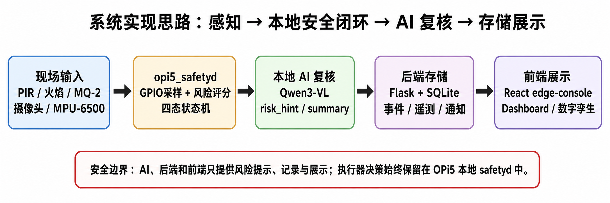
*图 1-1：系统感知与决策流程的实现思路*

### 1.2 项目的三代重构迭代过程
本项目经历了完整的“三次迭代”架构演进，体现了从单片机裸机到 Linux 边缘计算平台重构的工程实践过程：

| 迭代版本 | 硬件架构 | 控制机机制 | 核心局限性 / 重构原因 | 归档位置 |
| :--- | :--- | :--- | :--- | :--- |
| **第一代**<br/>(STM32/ESP) | STM32F103 + ESP32-CAM + 云端 AI | 单片机串口联动控制 | ESP32-CAM 端云链路不稳定，UART 通信协议联调成本过高，不具备本地计算能力。 | 代码归档于 [legacy/2026-stm32-esp32/](file:///home/qbz415/SafetyMonitor/legacy/2026-stm32-esp32/)<br/>文档见 [docs/archive/2026-stm32-esp32/](file:///home/qbz415/SafetyMonitor/docs/archive/2026-stm32-esp32/) |
| **第二代**<br/>(双板端边协同) | i.MX6ULL 运行安全闭环 + Orange Pi 5 运行 NPU 推理（双板端边协同） | i.MX6ULL C程序控制，通过网线向 OPi5 发送视频推理请求 | 硬件后期出现供电不稳定与启动异常故障；双板架构通信拓扑较复杂，在单板算力充沛时存在冗余。 | 代码与任务归档于 [docs/archive/2026-imx6ull-stage/](file:///home/qbz415/SafetyMonitor/docs/archive/2026-imx6ull-stage/) |
| **第三代**<br/>(当前主线) | **Orange Pi 5 一板承载全部职责**<br/>(一板三独立进程) | 进程级解耦，`opi5_safetyd` 独立掌控 GPIO/PWM 实现硬实时本地闭环 | **当前演示与答辩主线**。复用并迁移了第二代中已验证的 C 语言安全决策逻辑，通过多进程机制实现了硬件直控、AI推理与数据传输的完整解耦。 | 仓库主线根目录 [edge/](file:///home/qbz415/SafetyMonitor/edge/) 对应子模块 |

---

## 2. 软件运行架构与数据时序

### 2.1 总体软件运行架构
系统在 Orange Pi 5 边缘端采用一板多进程设计，在云端/PC 端采用 Web 后端与控制台：

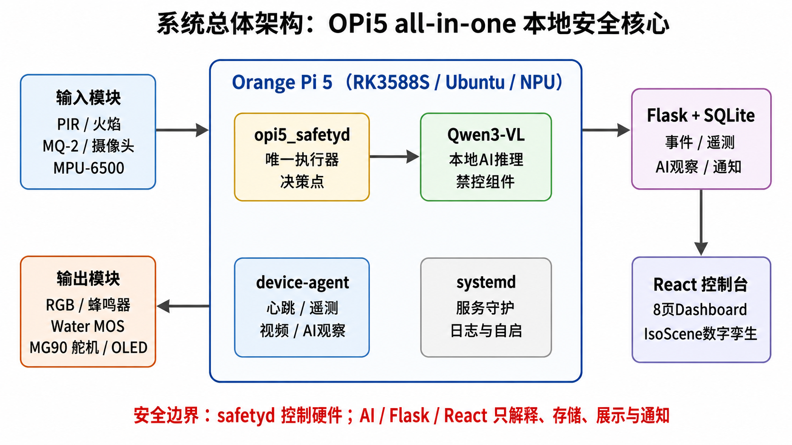
*图 2-1：系统总体多进程解耦与数据流转架构图*

在 Orange Pi 5 上独立运行的三个核心守护进程各司其职，保证了整个系统的稳定运行：
1. **安全控制进程**（[opi5_safetyd](file:///home/qbz415/SafetyMonitor/edge/opi5-controller/src/opi5_safetyd.c)，C 语言实现）：作为系统唯一的**执行器直接决策点**，负责 GPIO 传感信号采集（100Hz 高频轮询）、PWM 舵机驱动、蜂鸣器/RGB灯与水枪 MOS 的本地联动响应，基于硬实时有限状态机独立运作。
2. **AI 本地推理服务**（[opi5-ai](file:///home/qbz415/SafetyMonitor/edge/opi5-ai/)，Python 实现）：基于 NPU 加速，本地部署 Qwen3-VL 2B 模型，提供 `/api/infer/vision` 接口接收抓拍图像，返回 `risk_hint` 和自然语言的推理摘要。
3. **设备代理进程**（[opi5-device-agent](file:///home/qbz415/SafetyMonitor/edge/opi5-device-agent/app.py)，Python 实现）：充当通信与编排桥梁，管理物理摄像头并驱动舵机在多角度进行巡检扫视抓拍，同时每 5s 上报设备心跳，每 30s 周期打包遥测数据和 AI 观察上报给 Flask 后端。

在 PC 或开发宿主机上运行的监控端包括：
- **数据后端服务**（[server/backend/](file:///home/qbz415/SafetyMonitor/server/backend/)，Flask + SQLite）：提供事件、遥测、AI观察的持久化存储 API，支持基于 SMTP 协议的防抖邮件报警和 MJPEG 视频流中继。
- **前端可视化控制台**（[server/frontend/](file:///home/qbz415/SafetyMonitor/server/frontend/)，React + Vite）：提供 8 页面 Dashboard 管理面板，包含 IsoScene 数字孪生 3D 设施全貌图。

### 2.2 数据传输时序与通信流向
端与边、边与云之间通过 HTTP RESTful APIs 进行多通道并发交互：

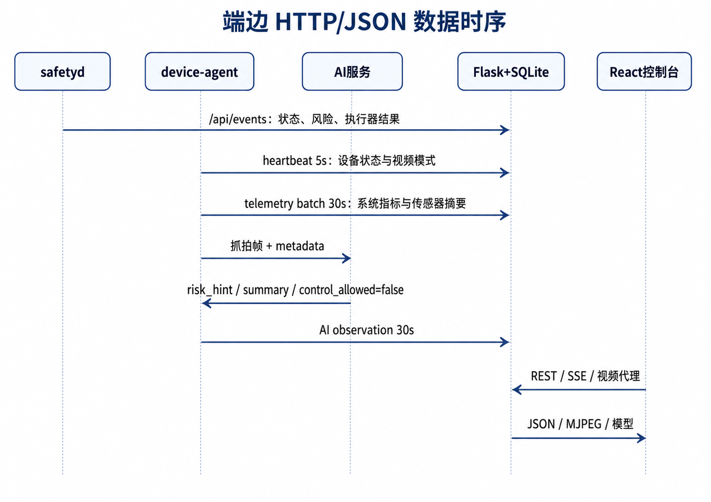
*图 2-2：系统进程间及端边云的数据通信时序图*

---

## 3. 硬件原理与引脚分配

系统完全通过 OPi5 的 26pin 外设扩展口直连物理外设，移除了不可靠的 PCA9685 中继方案，全部改用 GPIO 输入/输出及 SoC 原生 PWM 通道控制。

### 3.1 硬件设计原理图 (立创EDA)
硬件系统的完整接线、去耦电容及隔离设计电路图如下：

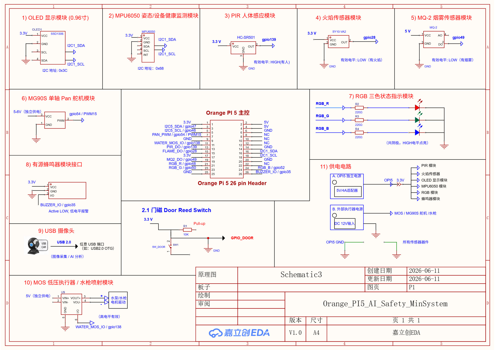
*图 3-1：系统的硬件电气接线原理图*

### 3.2 OPi5 26pin 物理引脚引出图
物理引脚与外部传感器及执行器的宏观对应关系：

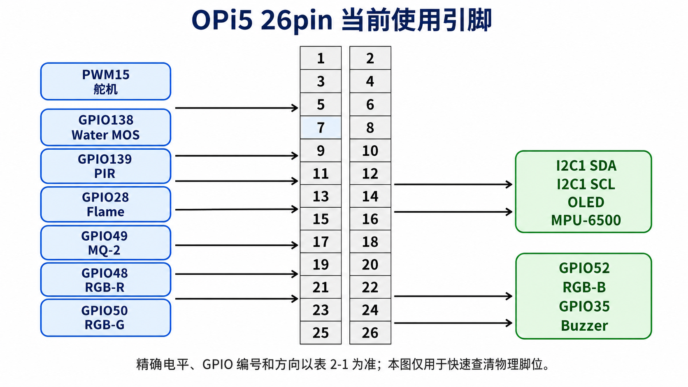
*图 3-2：Orange Pi 5 原生 26pin Header 外设引脚图*

### 3.3 核心引脚映射表

| 外设分类 | 逻辑信号 | OPi5 物理 Pin | Linux GPIO 编号 | 信号方向 | 有效电平/协议 | 外设具体型号与作用 |
| :--- | :--- | :--- | :--- | :--- | :--- | :--- |
| **I2C总线** | `I2C1_SDA` | pin 16 | GPIO_59 | 双向 | I2C 数据总线 | SSD1306 OLED (0x3C) + MPU6050 姿态传感器 (0x68) |
| | `I2C1_SCL` | pin 18 | GPIO_58 | 输出 | I2C 时钟总线 | 挂载于同一组 I2C1 物理接口实现设备共存与通信 |
| **物理输入** | `PIR_INPUT` | pin 13 | GPIO_139 | 输入 | Active HIGH | HC-SR501 人体红外运动探测传感器 |
| | `FLAME_INPUT`| pin 15 | GPIO_28 | 输入 | Active LOW | 光敏火焰传感器，用于明火探测 |
| | `MQ2_INPUT` | pin 19 | GPIO_49 | 输入 | Active LOW | MQ-2 烟雾与易燃气体传感器 |
| | `DOOR_INPUT` | - | - | 输入 | Pull-up | 门磁干簧管（历史引脚，由 runtime `raw_json` 兼容） |
| **驱动输出** | `PAN_SERVO` | pin 7 | PWM15 (chip 4) | 输出 | 50Hz PWM (0.5~2.5ms) | MG90S 模拟舵机，带动摄像头实现多角度扫视 |
| | `WATER_MOS` | pin 11 | GPIO_138 | 输出 | Active HIGH | 低压 MOS 驱动模块，控制 5V 演示灭火水泵水枪 |
| | `RGB_RED` | pin 21 | GPIO_48 | 输出 | Active HIGH | 共阴极三色 RGB LED - 红色指示灯 |
| | `RGB_GREEN` | pin 23 | GPIO_50 | 输出 | Active HIGH | 共阴极三色 RGB LED - 绿色指示灯 |
| | `RGB_BLUE` | pin 24 | GPIO_52 | 输出 | Active HIGH | 共阴极三色 RGB LED - 蓝色指示灯 |
| | `BUZZER` | pin 26 | GPIO_35 | 输出 | Active LOW | 有源高分贝报警蜂鸣器模块 |

### 3.4 供电拓扑与噪声隔离设计
大电流执行器（如 MG90S 舵机、演示水泵电机）在启动和制动瞬间会产生极高的反向电动势和尖峰电流，这极易导致 OPi5 的 3.3V/5V 轨压崩塌从而引发 SoC 复位，或通过地线为高阻抗总线（I2C）引入强烈毛刺。
为此，系统引入了**供电拓扑与星形共地物理隔离机制**：

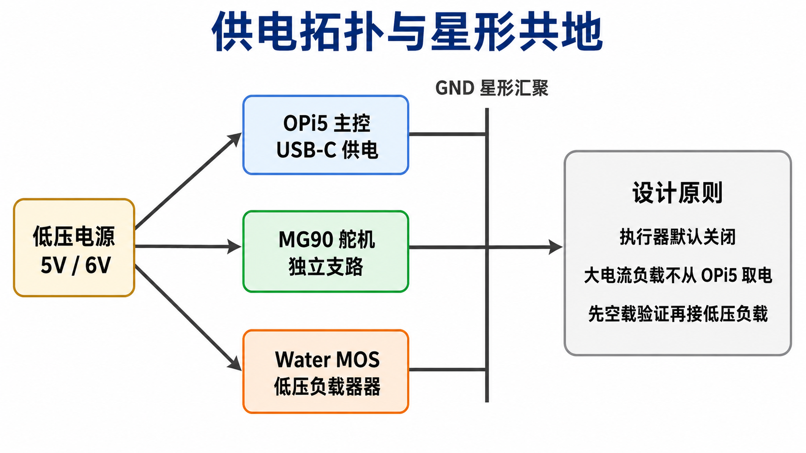
*图 3-3：星形共地与独立支路供电拓扑图*

- **独立电源分支**：OPi5 主机通过独立的 5V/4A Type-C 适配器进行纯净供电；舵机与水泵 MOS 等感性负载由外部 5V/6V/12V 的独立直流电源支路直接供电，不从 OPi5 的 Pin 脚分流。
- **GND 星形共地**：所有强电、弱电及数字信号的地线，只在电源侧的“GND 汇聚点”以星形拓扑单点汇接，防止大电流回路的共模阻抗干扰流经高敏感度元器件的地电位。
- **保护电路**：执行器默认状态为 OFF，MOS 栅极必须引入下拉电阻，确保未初始化时处于可靠截止状态。

---

## 4. 本地安全状态机与控制联动闭环

系统的核心设计哲学是**“本地安全第一，AI视觉复核，云端不做主控”**。

### 4.1 四态安全状态转换机 (FSM)
C 语言编写的 `opi5_safetyd` 运行一个有限状态机。状态转换受本地传感器风险评分和 AI 复核结果的共同驱动：

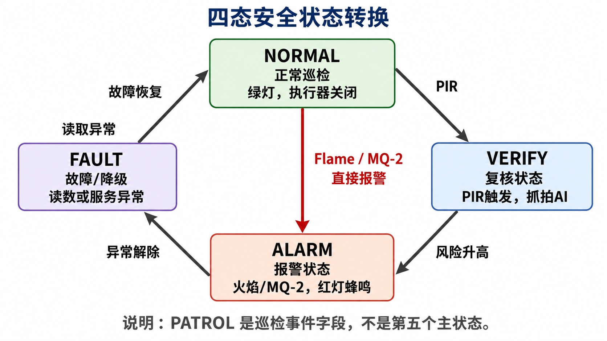
*图 4-1：本地 C 控制进程运行的安全状态机转换图*

- **`NORMAL` (常规态)**：无异常，RGB 灯为绿色，所有执行器关闭。
- **`WARN` (预警态)**：检测到人体移动 (PIR 触发)，Buzzer 短促间歇鸣叫，指示灯变黄。
- **`VERIFY` (复核态)**：由 PIR 触发或定时周期到达触发，舵机带动摄像头转向异常区域抓拍，并调用本地 AI 服务进行多模态视觉核实。
- **`ALARM` (报警态)**：火焰或烟雾传感器发生强触发，或者本地触发且 AI 复核确认有火灾隐患。RGB 亮红灯，Buzzer 持续长鸣，激活 Water MOS 水枪。
- **`FAULT` (故障降级态)**：当 I2C 读取失败、AI 超时或摄像头故障时，系统自动降级，指示灯呈紫色闪烁，依靠剩余传感器在本地坚守防线。
*(注：`PATROL` 代表巡检事件，仅作为事件流上报的分类标签，不是状态机的第五个主状态。)*

### 4.2 `opi5_safetyd` 软件主循环逻辑
安全控制进程的内部主逻辑按固定时钟节拍循环运转：

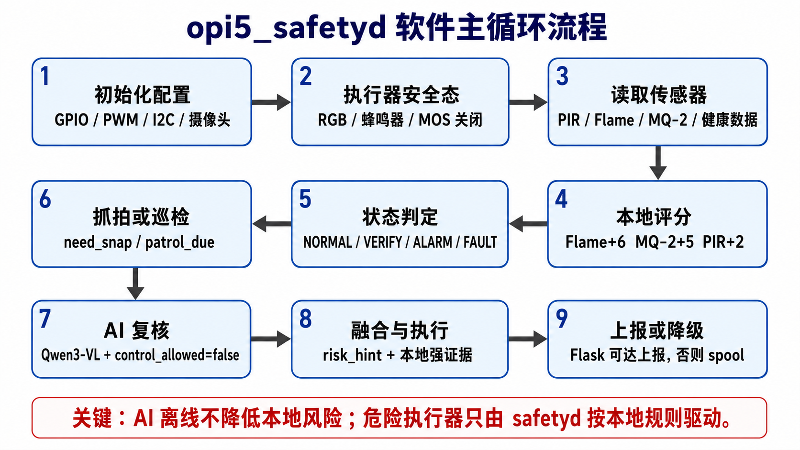
*图 4-2：C语言控制核心进程 `opi5_safetyd` 的主循环逻辑图*

1. **本地评分计算**：
   $$\text{Risk Score} = \text{clamp}(\text{PIR} \times 2 + \text{MQ2} \times 5 + \text{Flame} \times 6 + \text{AI Risk} \times \text{weight}, 0, 10)$$
2. **AI 隔离原则**：AI 服务的决策置信度只作为 `ai_adjust` 调节加分。如果 AI 通信超时或崩溃，系统扣减 AI 分数但绝不降低本地传感器的评分，保证本地强证据不被 AI 离线“掩盖”。
3. **本地降级与 spool**：若 Flask 后端无法连通，事件数据将被序列化并缓存在本地 `/opt/spool/` 目录下，并在网络恢复后以 FIFO 队列进行 flush 补发。

---

## 5. 本地 AI 视觉推理与执行器双确认联锁

### 5.1 本地 Qwen3-VL 推理架构
推理服务完全基于本地 NPU 的 RKNN-LLM 运行，摆脱了对公网大模型 API 的网络依赖。

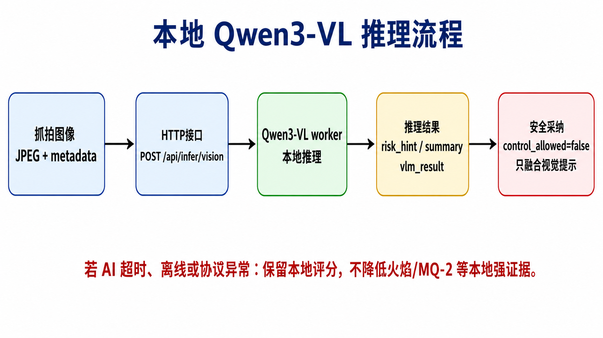
*图 5-1：本地大模型视觉推理服务调用流程图*

- **推理阻断**：AI 响应的 JSON 中 `control_allowed` 被硬编码为 `false`。即使 AI 判定环境存在极其严重的火灾，它也仅将 `risk_hint` 发送给 `safetyd`；启动水泵的决策链依旧在 C 进程的 AND 门控中。

### 5.2 灭火喷淋控制双确认机制
为了杜绝 AI 误识别（例如将红色衣物误判为火焰）导致水泵误开冲刷电子元件，系统引入了**物理-AI双确认 AND 联锁机制**：

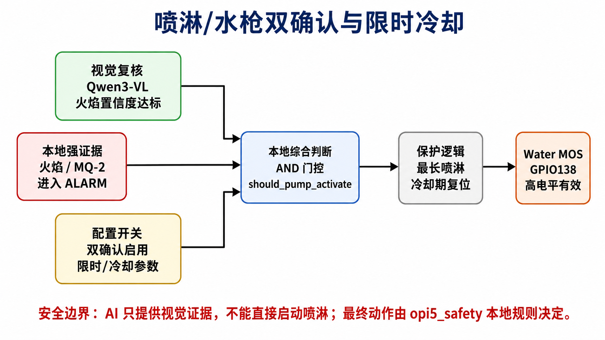
*图 5-2：执行器喷淋动作 of AND 门控双重确认逻辑*

- **AND 门控**：
  $$\text{Activate Pump} = \text{Local Flame Alarm} \land \text{AI Flame Detected} \land \text{Threshold Enabled}$$
  只有当本地光敏火焰传感器输出低电平（有明火）且 Qwen3-VL 在抓拍画面中置信度达标，同时用户在云端启用了双确认联锁时，控制信号才会被送往 GPIO138。
- **保护电路与限时冷却**：为防止水泵持续抽水导致淹溢，C 程序内置了 `max_pump_duration`（例如单次连续喷淋不得超过 10 秒），并在喷淋结束后强制进入 `cooldown_seconds`（例如冷却期 30 秒）进行冷却保护。

---

## 6. 定时巡检与自适应 Mock 引擎

### 6.1 定时巡检三点扫描机制
设备代理进程控制 MG90S 舵机以 30 秒为一周期进行周期性转动巡视，带动摄像头形成三点视角，抓拍当前视角快照：

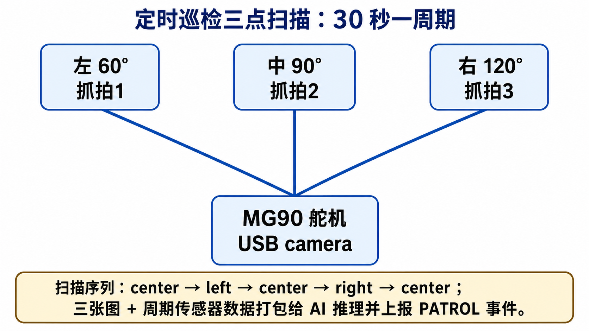
*图 6-1：MG90S 舵机三点扫描巡回序列与上报逻辑*

- **扫描动作流**：`Center (90°)` $\rightarrow$ `Left (60°) 抓拍1` $\rightarrow$ `Center` $\rightarrow$ `Right (120°) 抓拍3` $\rightarrow$ `Center 抓拍2`。
- **打包上报**：在一个周期结束后，三张图片与对应的三轴振动采样值和气体浓度数值打包，上报给 Flask，并最终以 `PATROL` 事件推送到前端事件日志中。

### 6.2 硬件热拔插与自适应 Mock 模拟引擎
系统实现了高度平滑的 **Mock 与 Real 自适应引擎**，在硬件未就绪、无摄像头或脱机展示场景下依然能够进行完整的业务流程演示：
- **传感器自适应**：在 [mock_sensors.py](file:///home/qbz415/SafetyMonitor/edge/opi5-device-agent/mock_sensors.py) 和 [video.py](file:///home/qbz415/SafetyMonitor/edge/opi5-device-agent/video.py) 中，`device-agent` 会在初始化时主动探测物理设备（如检查 `/dev/video0`、是否能通过 I2C 轮询到 `0x68` 等）。
- **无缝回退**：若物理外设离线，系统自动加载 Mock 引擎。Mock 视频模块会以 12fps 的速度自动在内存中渲染出带有波动伪色彩的动态设备背景图；Mock 传感器模块使用基于高斯噪声的正弦波动发生器，模拟输出符合温度、湿度和轻微振动规律的 telemetry 数据。
- **状态感知**：一旦物理设备被热插拔连入，在下一次心跳周期中，系统会自动将心跳中的 `camera.mode` 由 `"mock"` 修正为 `"real"`，同时将获取途径无缝重定向到真实的 `/dev/video0` 与 I2C 寄存器。

---

## 7. 端边 HTTP/JSON 数据契约规范

### 7.1 设备心跳上报数据包 (`POST /api/devices/heartbeat`)
每 5 秒上报一次，包含系统守护进程状态、CPU/内存指标及摄像头详细工作模式：

```json
{
  "device_id": "edge-opi5-001",
  "timestamp": "2026-06-21T18:16:19Z",
  "agent_version": "0.2.0",
  "ip": "10.96.98.38",
  "agent_url": "http://10.96.98.38:8090",
  "agent_port": 8090,
  "uptime_s": 3600.5,
  "online": true,
  "services": {
    "device_agent": "running",
    "opi5-ai-qwen3vl": "active",
    "opi5-safetyd": "active"
  },
  "health": {
    "cpu_temp_c": 60.1,
    "mem_used_mb": 4096,
    "mem_total_mb": 16384,
    "cpu_load_1m": 1.42,
    "disk_used_pct": 28.6
  },
  "camera": {
    "status": "online",
    "mode": "real",
    "available": true,
    "device": "/dev/video0",
    "width": 1280,
    "height": 720,
    "fps": 12,
    "mock": false
  },
  "camera_status": "online",
  "video_mode": "real",
  "video_available": true
}
```

### 7.2 遥测批量上报数据包 (`POST /api/telemetry/batch`)
周期为 30 秒，将每秒高频采样的振动、环境指标及设备底层状态进行窗口化打包：

```json
{
  "device_id": "edge-opi5-001",
  "window": {
    "start": "2026-06-21T18:15:00Z",
    "end": "2026-06-21T18:15:30Z",
    "sample_count": 30,
    "sample_interval_ms": 1000
  },
  "samples": [
    {
      "ts": "2026-06-21T18:15:00Z",
      "risk_score": 1.5,
      "sensors": {
        "mpu6500": {
          "accel_x": 0.12,
          "accel_y": -0.18,
          "accel_z": 9.81,
          "gyro_x": 0.01,
          "gyro_y": -0.02,
          "gyro_z": 0.00,
          "vibration_score": 2.03
        },
        "env": {
          "temp_c": 26.9,
          "humidity_pct": 55.2,
          "light_lux": 320
        },
        "safety": {
          "pir": 0,
          "flame": 0,
          "mq2": 0
        }
      },
      "device": {
        "cpu_temp_c": 59.2,
        "mem_used_mb": 4090,
        "mem_total_mb": 16384,
        "cpu_load_1m": 1.40,
        "disk_used_pct": 28.6
      },
      "sensor_scores": {
        "smoke": 0.32,
        "flame": 0.00,
        "mpu6500_vibration": 2.03,
        "cpu_temp": 1.10
      }
    }
  ],
  "summary": {
    "risk_score": {"min": 1.0, "avg": 1.5, "max": 2.5, "latest": 1.9},
    "cpu_temp_c": {"min": 58.5, "avg": 59.1, "max": 60.1, "latest": 60.1},
    "mpu6500_vibration": {"min": 1.95, "avg": 2.01, "max": 2.10, "latest": 2.01}
  }
}
```

### 7.3 AI Observation 上报数据包 (`POST /api/ai/observations`)
设备代理定时向本地 NPU AI 服务发起图片推理后，将大模型的视觉理解解释内容和置信度评估上报至 Flask：

```json
{
  "device_id": "edge-opi5-001",
  "timestamp": "2026-06-21T18:16:00Z",
  "window_sec": 30,
  "model": {
    "name": "qwen3-vl-2b",
    "backend": "rknn-llm",
    "mode": "worker",
    "model_ready": true
  },
  "risk_hint": 0,
  "summary": "画面显示一个电子设备的内部，包含电路板、按钮和指示灯等组件，但图像模糊且存在明显的光线反射与杂乱连接，无法清晰辨认具体操作状态。",
  "full_text": "Qwen3-VL本地视觉推理判定：当前区域温度指标稳定，无异常人员停留，烟雾与火焰检测结果为阴性，没有发现明显的安全异常。",
  "labels": ["pcb", "electronics"],
  "ok": true,
  "error": null
}
```

---

## 8. Web 管理控制台 (Vite React Edge-Console)

Web 前端基于 React 和 Vite 构建，包含 8 个功能管理子面板，为巡检人员提供直观的操作交互。

### 8.1 总览面板 (Overview Dashboard)
作为控制中心，汇总展示设备 3D 拓扑、实时监控画面、AI 观察摘要、风险评分变化趋势以及关键系统参数：

````carousel
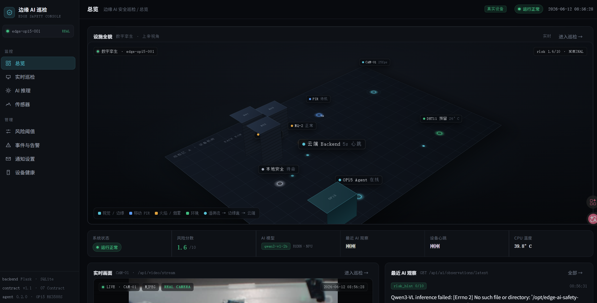
<!-- slide -->
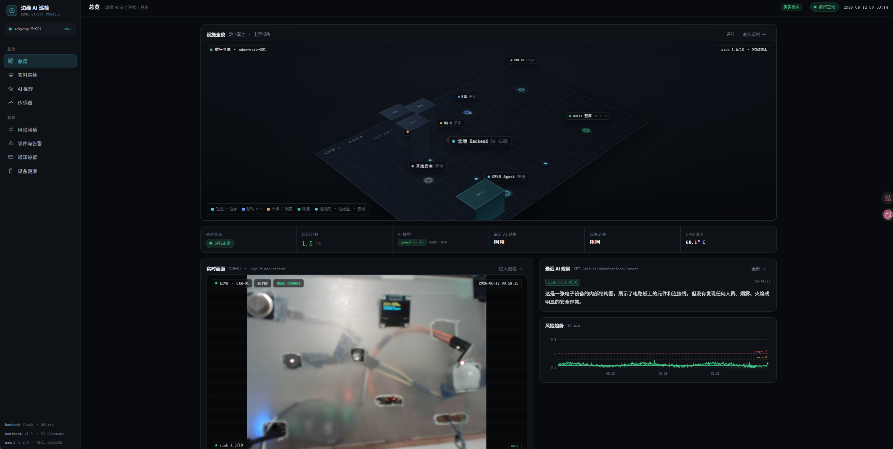
<!-- slide -->
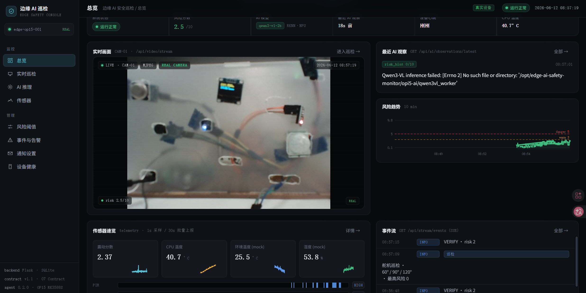
<!-- slide -->

````
*图 8-1：Dashboard 总览界面的多种运行状态（AI 报错、正常巡检、视频搭载及人体触发）*

- **核心子组件**：
  - **IsoScene 3D 数字孪生全貌图**：采用三维等角投影（Isometric）绘制。网格化展示 R01、R02、R03 设备机房的物理防区。PIR、MQ-2 等传感器的状态与主控板的连线在 3D 场景中动态流转。当发生人体接近事件时，PIR 标签处的圆环将变成红色闪烁，提供“上帝视角”的直观监控。
  - **实时视频画面**：通过 Flask 中继代理，直接从边端 `device-agent` 提取实时的 MJPEG 视频流，并在视频左下角动态叠加当前的计算风险分（如 `risk 1.9/10`）。
  - **风险分数时序趋势图**：以 10min 为滑动窗口，展示系统风险值的波动情况，内置 Danger (5) 和 Warn (3) 阈值警戒线。
  - **最新 AI 观察卡片**：从 `/api/ai/observations/latest` 接口高频拉取，滚动展示由本地部署的 Qwen3-VL 2B 模型生成的推理结论，如在推理服务出现崩溃时展示详细的 Python Traceback 报错，而在推理成功时显示具体电路板无异常的自然语言分析。

### 8.2 实时巡检面板 (Real-time Inspection)
针对单个设备进行高清视轨监控与安全参数跟踪：

````carousel
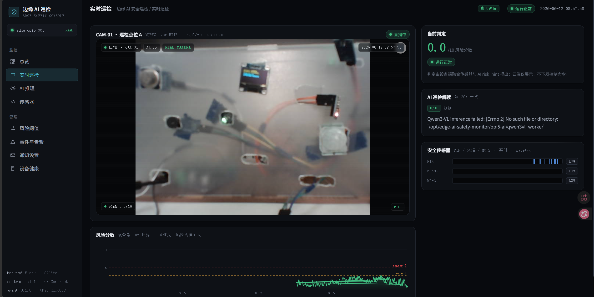
<!-- slide -->

````
*图 8-2：实时巡检面板的初始化与推理加载状态*

- **核心子组件**：
  - **当前判定指标卡**：突出展示 0~10 的实时综合风险得分。标有安全红线提示：“判定由设备端融合传感器与 AI risk_hint 得出；云端仅展示，不下发控制命令。”
  - **AI 巡检解读流**：每 30s 滚动更新一次。详细解析大模型的视觉场景理解文本。
  - **二值化传感器逻辑分析轨**：以波形时间轴展示本地底层 PIR、FLAME、MQ-2 开关量传感器的历史高低电平触发记录。

### 8.3 AI 推理面板 (AI Inference Panel)
查看本地端侧 NPU 大模型的详细推理时延、推理日志和视觉语言模型的完整输出：

````carousel
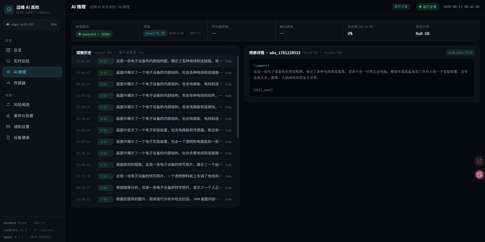
<!-- slide -->

````
*图 8-3：AI推理面板的推理时序历史与 VLM 推理详情*

- **核心子组件**：
  - **推理运行状态卡**：监控本地 NPU 运行环境。提供模型版本（Qwen3-VL 2B RKNN-LLM • NPU×3）、推理调用平均端到端时延（约 86~120ms）及模型调用的失败率统计（0%）。
  - **推理历史日志池**：按时间倒序排列的卡片流，列出各历史秒级抓拍快照通过 VLM 进行评估的分数（如 `0/10` 或 `2/10`）以及精简提取的 summary 文本。
  - **详情展开区**：可点击展开 `[summary]` 卡片和 `[full_text]` 原始输出文本，获取大模型对现场环境的深度语言剖析。

### 8.4 传感器面板 (Sensors Monitor)
针对以 MPU6050 为代表的高频连续物理量传感器进行实时的时序图表展示：

````carousel
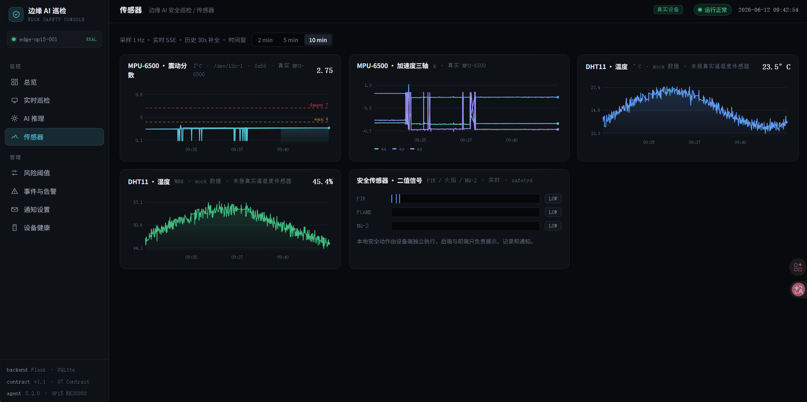
<!-- slide -->

````
*图 8-4：传感器面板的数据流监测图表*

- **核心子组件**：
  - **MPU-6500 震动分数时序图**：展示物理硬件测得的 vibration_score 时序曲线，用于精确感知设备是否有移位、敲击或抖动。
  - **MPU-6500 三轴加速度图**：展示原生读出的 ax, ay, az 三轴重力加速度分量（单位为 g），直接反应姿态倾角变化。
  - **DHT11 温湿度图**：展示环境温度 (℃) 和湿度 (%RH) 的波动趋势（硬件未连接时自适应加载 Mock 发生器的正弦温湿度波动曲线）。
  - **实时开关量波形**：直观展示底层 safetyd 驱动的 PIR、FLAME、MQ-2 的高频脉冲波形图。

### 8.5 事件与告警面板 (Events & Alerts)
用于记录系统生命周期内所有的非正常状态警报和正常巡检事件：

````carousel
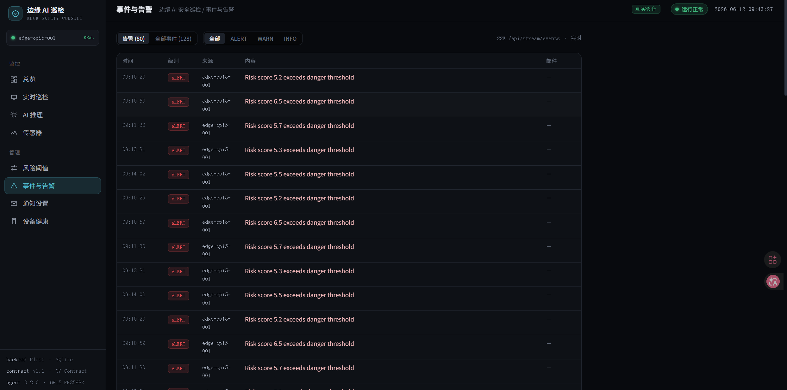
<!-- slide -->

````
*图 8-5：系统警报与常规巡检事件记录面板*

- **核心子组件**：
  - **告警事件池 (Alarms Log)**：高亮展示级别为 `ALERT` 的危险告警。例如记录 `Risk score 6.5 exceeds danger threshold`，并标记对应的发信通道（如邮件发送状态）。
  - **常规事件池 (Events Log)**：展示系统常态化的 `INFO` 级事件。例如记录“舵机巡检 • 60°/90°/120° • 本轮3角度巡检未发现火焰或烟雾异常”及设备连线事件，支持按 SSE 实时流模式无刷新动态滚动追加。

### 8.6 设备健康面板 (Device Health)
针对边缘端主控板（Orange Pi 5）的系统负载、功耗、温控及系统守护服务状态进行全方位监测：

````carousel
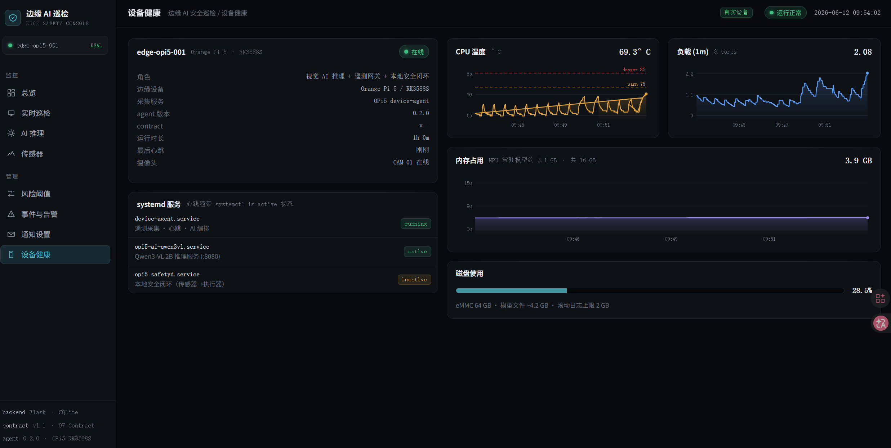
<!-- slide -->

````
*图 8-6：设备健康状态面板下的服务监视（含 inactive 预警和 active 正常状态）*

- **核心子组件**：
  - **systemd 服务心跳状态监视器**：直接轮询 OPi5 后台 systemctl is-active 命令获取服务生命特征：
    - `device-agent.service`（设备代理进程状态）
    - `opi5-ai-qwen3vl.service`（本地 NPU AI 服务状态）
    - `opi5-safetyd.service`（本地 C 语言安全决策进程状态）
  - **SoC 性能指标曲线**：展示 CPU 温度（带 danger 85℃ 和 warn 75℃ 参考线，常温运行在 60℃ 左右）、系统负载（8核，1m 负载）、内存占用情况（16GB，由于 Qwen3-VL 2B 模型常驻，会显示 NPU 常驻内存约 3.1 GB，总占用在 4.0 GB 左右）以及磁盘 eMMC 存储的百分比。

### 8.7 通知设置面板 (Notification Settings)
用于设置边缘控制平台与网络云端之间的消息推送通路：


*图 8-7：邮件服务器及防抖规则通知设置面板*

- **核心子组件**：
  - **SMTP 服务器参数配置区**：可配置第三方 SMTP 发件服务商（如配置 `smtp.qq.com` 端口 `465`，并支持密码掩码保护）。
  - **告警防抖冷却器 (Cooldown)**：允许设定冷却时间参数（例如 30s）。在连续爆发的高频重复告警期间，冷却防抖保护机制将被激活，处于冷却时间窗口内的报警仅记录为 skipped，不再重复发信。
  - **发信日志追踪区**：展示基于 SSE 获取的消息队列发送流水。详细记录发件的成功与失败状态，并在邮件发送超时（如 `handshake operation timed out` 或 `Name or service not known`）时输出明确的调试错误日志，方便网络排查。

### 8.8 风险阈值面板 (Risk Thresholds)
管理人员在此配置云端及控制台触发告警动作判定时的动态数值：


*图 8-8：四项告警判定阈值参数的配置面板*

- **核心子组件**：
  - **阈值矩阵表格**：可单独修改四种基础指标 learnings。设置 Warn（黄色警告）与 Danger（红色报警）阈值：
    - **风险分数** (0.1~10)
    - **CPU 温度** (0~100℃)
    - **震动分数** (0~10)
    - **烟雾分数** (0~10)
  - **云边解耦机制**：阈值底部的生效机制再次向用户声明：此处配置的云端阈值用于在云端和前端管理面板生成红色/黄色横幅警告，**设备端（OPi5）本地安全闭环使用的是设备端自身的内置阈值硬编码，云端阈值的丢失或错误配置不会影响本地安全控制的保底防线。**

---

## 9. 编译、启动与部署说明

### 9.1 底层安全 C 程序的原生编译
在 Orange Pi 5 本地，进入控制程序源码目录并运行编译脚本：

```bash
# 检查引脚配置文件及C源码是否存在语法错误
python -m py_compile server/backend/*.py edge/opi5-device-agent/*.py

# 编译 C 语言安全控制核心程序 opi5_safetyd
cd edge/opi5-controller
mkdir -p build && cd build
cmake ..
make -j4
```

### 9.2 边缘端 systemd 服务部署
系统依赖 systemd 管理 3 个核心服务。可将对应的模板拷贝到系统服务目录并启动：

```bash
# 复制 systemd 配置文件至系统目录
sudo cp config/templates/opi5-*.service /etc/systemd/system/
sudo systemctl daemon-reload

# 启动本地安全闭环进程
sudo systemctl enable --now opi5-safetyd.service

# 启动本地大模型推理服务
sudo systemctl enable --now opi5-ai-qwen3vl.service

# 启动设备代理与遥测进程
sudo systemctl enable --now opi5-device-agent.service

# 检查各服务状态，确保均为 active (running)
sudo systemctl status opi5-safetyd.service opi5-ai-qwen3vl.service opi5-device-agent.service
```

### 9.3 局域网网络拓扑配置
为保证设备通信流畅，推荐采用全无线局域网热点拓扑：
- **热点拓扑网段**：在同一路由器或手机热点下，分配的网段应一致（例如 `10.96.98.0/24`）。
- **静态IP绑定**：将 Orange Pi 5 绑定为固定 IP（例如 `10.96.98.38`），并在 Flask 后端的配置文件中指定 `OPI5_DEVICE_AGENT_URL=http://10.96.98.38:8090`，以确保视频流和控制台数据交互无阻。

### 9.4 数据后端 (Flask) 启动
在 PC 端或服务器端，初始化数据库并拉起 API 后端：

```bash
cd server/backend
# 安装必要的库依赖
pip install -r requirements.txt

# 运行 API 服务进行快速健康验证
python app.py
```

### 9.5 可视化控制台 (React) 编译
在开发机或本地终端中，通过 Vite 对控制台前端页面进行编译：

```bash
cd server/frontend
# 安装前端依赖
npm install

# 启动本地开发服务以预览 Dashboard
npm run dev

# 编译生产环境静态文件并注入 Flask static 文件夹中
npm run build
```

---

## 10. 答辩亮点与课程验证总结

本项目为嵌入式 Linux 数字系统项目提供了标准范式，可用于课程答辩和现场实训汇报：

1. **真实工程演进证明**：保留了完整的三代系统重构记录（`STM32 裸机` $\rightarrow$ `i.MX6ULL + OPi5 双板端边协同` $\rightarrow$ `OPi5 独立单板多进程守护`），体现了完整的开发闭环和解决软硬件迁移瓶颈的能力。
2. **严密的控制与安全边界**：将危险大电流执行器（水泵、舵机）的控制权物理锁死在 C 语言实现的 `opi5_safetyd` 底层状态机中，大模型及云端控制台只读且 `control_allowed=false` 彻底杜绝了软件误判引起的安全灾难。
3. **软硬件噪声隔离与共地设计**：采用“强电与弱电独立支路供电”和“GND 汇聚点星形共地”拓扑，不仅有效保护了 OPi5 免受电压瞬变干扰，且在逻辑分析仪监测下确保了 I2C1 SDA/SCL 信号的极高波形完整度。
4. **自适应 Mock 引擎**：软件设计极具鲁棒性，系统启动后可根据传感器和视频端口状态自适应切入 Mock 模式与 Real 硬件模式，确保即使没有携带演示箱也可以在无物理硬件的状态下顺畅地进行全部页面的模拟演示。
